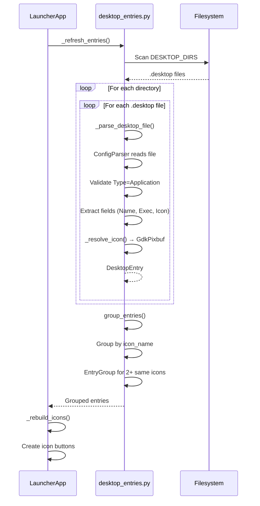
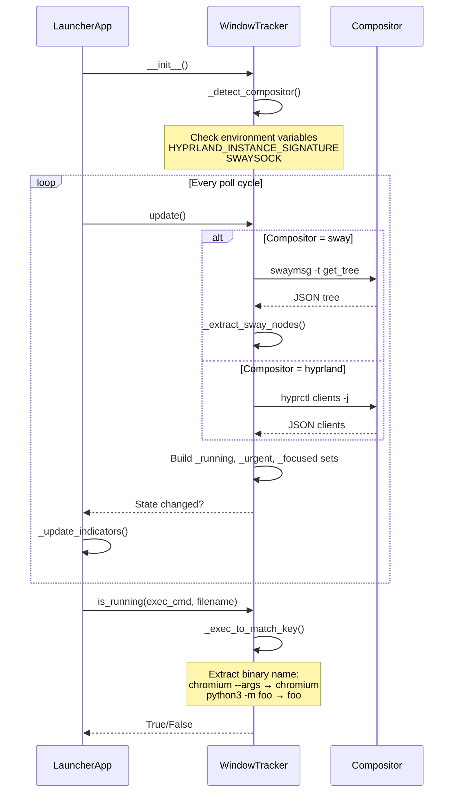
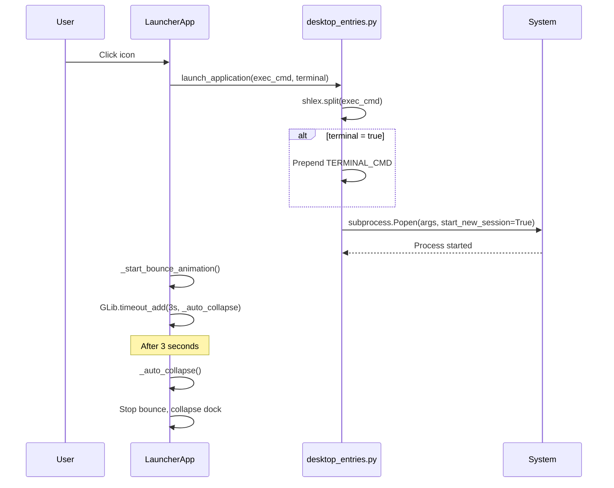
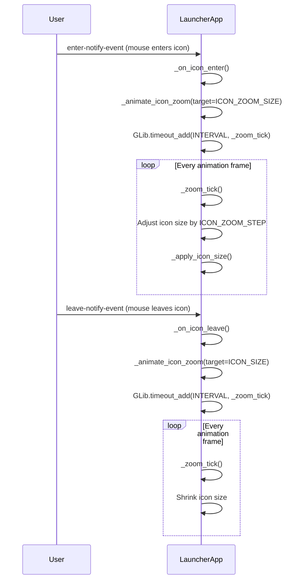

# madOS Launcher

A lightweight GTK3-based application dock for Wayland compositors (Sway/Hyprland). Provides a retractable icon dock anchored to the left edge of the screen with running application indicators.

## Features

- **Retractable dock** - Click or drag the grip tab to expand/collapse
- **Application icons** - Scans `.desktop` files from standard directories
- **Icon grouping** - Multiple apps with the same icon are grouped into a single slot
- **Running indicators** - Shows dot indicators for running/focused/urgent windows
- **Window tracking** - Queries compositor (Sway/Hyprland) to detect running apps
- **Hover zoom animation** - Icons smoothly scale on mouse hover
- **Bounce animation** - Clicked icons bounce when launching apps
- **Auto-collapse** - Dock automatically collapses 3 seconds after launching an app
- **Position persistence** - Saves dock position and expanded state
- **Nord theme** - Uses the Nord color palette for a cohesive look

## Requirements

- Python 3.x
- GTK3 (`gir1.2-gtk-3.0`)
- GdkPixbuf (`gir1.2-gdkpixbuf-2.0`)
- gtk-layer-shell (optional, for Wayland layer shell support)
- Sway or Hyprland compositor

## Installation

```bash
# Clone the repository
git clone https://github.com/yourusername/mados-launcher.git
cd mados-launcher
```

## Running

```bash
python3 -m mados_launcher
```

Or run directly:

```bash
python3 __main__.py
```

## Usage

- **Expand dock**: Click the grip tab on the left edge of the screen
- **Collapse dock**: Click the grip tab again (or it auto-collapses after launching an app)
- **Move dock**: Drag the grip tab vertically to reposition
- **Launch app**: Click an icon in the expanded dock
- **Launch grouped app**: Click a group icon to see a popup menu, then click the desired app

## Architecture

The application consists of three main modules:

### app.py - LauncherApp

The main application class that:
- Creates and manages the GTK window
- Builds the dock UI with icons and grip tab
- Handles user interactions (click, drag, hover)
- Manages animations (zoom, bounce)
- Polls compositor for window state
- Persists dock state

### desktop_entries.py

Handles `.desktop` file scanning:
- `scan_desktop_entries()` - Scans standard directories for .desktop files
- `DesktopEntry` - Data class representing a parsed entry
- `EntryGroup` - Groups multiple entries sharing the same icon
- `launch_application()` - Launches an app via subprocess

### window_tracker.py

Tracks window state via compositor IPC:
- `WindowTracker` class queries Sway or Hyprland
- Detects running, focused, and urgent windows
- Uses `swaymsg` or `hyprctl` to query window tree

## Configuration

Configuration constants are defined in `config.py`:
- Colors (Nord palette)
- Icon sizes
- Animation durations
- Refresh intervals

## State Persistence

Dock state is saved to `~/.config/mados-launcher/state.json`:
- Vertical position (`margin_top`)
- Expanded/collapsed state (`expanded`)

## Sequence Diagrams

### Main Application Flow

```mermaid
sequenceDiagram
    participant U as User
    participant C as Compositor<br/>(Sway/Hyprland)
    participant A as LauncherApp
    participant T as WindowTracker

    rect rgb(40, 44, 52)
        Note over A: __init__()
        A->>A: Load persisted state
        A->>A: Apply theme (Nord CSS)
        A->>A: Build GTK window
        A->>A: Build UI (revealer, icons, grip)
        A->>A: Scan desktop entries
        A->>A: Build icon buttons
        A->>A: Start periodic tasks
    end

    loop Every WINDOW_POLL_MS (2000ms)
        A->>T: update()
        T->>C: Query compositor IPC
        C-->>T: Window list
        T->>T: Extract app_id, urgent, focused
        T-->>A: State changed?
        A->>A: _update_indicators()
    end

    rect rgb(40, 44, 52)
        Note over U,A: Click grip tab
        U->>A: button-press-event
        U->>A: button-release-event
        A->>A: Toggle _expanded
        A->>A: _revealer.set_reveal_child()
        A->>A: Save state
    end

    rect rgb(40, 44, 52)
        Note over U,A: Click icon
        U->>A: _on_icon_clicked()
        A->>A: _cancel_zoom_animation()
        A->>A: launch_application()
        A->>A: _start_bounce_animation()
        A->>A: _schedule_auto_collapse()
    end

    rect rgb(40, 44, 52)
        Note over A: After 3 seconds
        A->>A: _auto_collapse()
        A->>A: Stop bounce animations
        A->>A: Collapse dock
        A->>A: Save state
    end
```



### Desktop Entry Scanning Flow



### Window Tracking Flow



### Application Launch Flow



### Icon Hover Animation Flow



### Group Popover Flow

```mermaid
sequenceDiagram
    participant U as User
    participant A as LauncherApp

    U->>A: Click group icon
    A->>A: _on_group_clicked()
    A->>A: Create Popover widget
    
    rect rgb(40, 44, 52)
        Note over A: Popover displayed
        loop For each entry in group
            U->>A: Click entry row
            A->>A: _on_popover_item_clicked()
            A->>A: popover.popdown()
            A->>A: launch_application()
            A->>A: _start_bounce_animation()
            A->>A: _schedule_auto_collapse()
        end
    end

    U->>A: Click outside popover
    A->>A: _dismiss_active_popover()
    A->>A: popover.popdown()
```

